WRO 2026 Future Engineers - DeluluBots
====

## Table Of Contents
1. [Team](#1-team)
2. [Challenge Overview](#2-challenge-overview)
3. [Our Robot](#3-our-robot)
4. [Hardware](#4-hardware)
    * 4.1. [Mobility Management](#41-mobility-management)
    * 4.2. [Power and Sense Management](#42-power-and-sense-management)
5. [Software](#5-software)
    * 5.1. [Computer Vision](#51-computer-vision)
    * 5.2. [Vehicle Control](#52-vehicle-control)
6. [DIY Game Field](#6-diy-game-field)  
7. [License](#7-license)

## 1. Team

<p align="center">
  
</p>

<p align="center">
  <strong>DELULUBOTS</strong><br>
  <em>Delulu Today, Limitless Tomorrow.</em>
</p>

We are **DeluluBots**, an independent robotics team of students passionate about **robotics, programming, electronics, and innovation**.

**DeluluBots was born from a simple but ambitious dream: to build our own robot and compete in WRO.** At the beginning, it seemed like a delulu idea—we had limited resources, little experience with many of the technologies involved, and no clear way to afford the journey ahead. But instead of seeing those limitations as a reason to stop, we saw them as a reason to start. That mindset became the foundation of our team.

> *Delulu* is an informal term for being “delusional” in an optimistic way: believing in something that may seem unrealistic and choosing to pursue it anyway.

Our journey is guided by one simple idea: **“Delulu Today, Limitless Tomorrow.”** As an independent team, we have worked hard to build a competitive robot while finding ways to make our participation possible. To help cover the costs of our robot and our trip to the national competition, we started **selling homemade cookies and spicy gummy candies in our city**. Every sale brought us one step closer to our goal.

More than building a robot, we aim to grow as people and engineers capable of **creating, innovating, and turning ideas into reality**. WRO has encouraged us to learn beyond what we are normally taught at university, explore technologies we had never worked with, and solve challenges independently.

Through every failure and iteration, we have learned that **perseverance is just as important as technical knowledge**. We are proud of how far we have come and excited to keep learning, improving, and staying *delulu*.

---

### Best & Fun Moments

<p align="center">
  
  
</p>

<p align="center">
  
  
</p>

---

### Team Members

<table>
<tr>
<td width="65%" valign="top">

## **Saori Jasso**

**Electronics · PCB Designer · Software Developer**

**Age:** 19

I am an **Information Technology Engineering student** and was responsible for the robot’s electrical system, from **selecting components and designing the PCB** to developing the systems that allow it to power on with just two buttons.

I also contributed to the **software development** and was responsible for **designing and building our DIY Game Field** for testing and practice.

WRO gave me the opportunity to design my **first PCB** and challenge myself with technologies I had never worked with before. Since middle school, robotics has been one of my greatest passions, and I hope to **inspire more girls to explore STEM, pursue engineering, and discover the same passion for robotics.**

</td>

<td width="35%" align="center" valign="middle">


</td>
</tr>
</table>

---

<table>
<tr>
<td width="65%" valign="top">

## **Jesús Morales**

**Mechanical & CAD Designer · Software Developer**

**Age:** 19

I am an **Information Technology Engineering student** and served as the Mechanical & CAD Designer and Software Developer for our robot.

This project marked my first time fully designing an **entire mechanical system from scratch in CAD**—a challenge that required balancing spatial constraints, weight distribution, and structural integrity.

My passion for technology started at a young age, but growing up in my hometown, hands-on STEM opportunities were limited. Moving to Mexico gave me the chance to explore robotics throughout my school years, shaping my path into engineering.

WRO has been an incredible opportunity to **push my technical limits**, and I hope to inspire others to pursue STEM regardless of their background.

</td>

<td width="35%" align="center" valign="middle">


</td>
</tr>
</table>

---

<table>
<tr>
<td width="65%" valign="top">

## **Kevin Rucoba**

**Coach**

**Age:** 21

I am a **Software Development Engineering student** and have supported and advised the team throughout all areas of the project.

From helping with **technical challenges and brainstorming ideas** to guiding decisions and overcoming unexpected problems, I've always been there to provide a different perspective when needed.

My goal is to **support their ideas, share my experience, and help them turn their ideas into reality** while encouraging them to learn, experiment, and grow as a team.

I also helped the team stay focused on our goals, encouraged us to keep improving after setbacks, and shared the experience needed to approach challenges with **confidence, creativity, and perseverance**.

</td>

<td width="35%" align="center" valign="middle">


</td>
</tr>
</table>

---


## 2. Challenge Overview

## 3. Our Robot

### Performance Videos

Take a look at our robot in action during the WRO 2026 Future Engineers challenges.

<table>
<tr>
<td align="center" width="50%">

<strong>Open Challenge</strong>

<a href="https://www.youtube.com/watch?v=468RyVULAOA">
  
</a>

<br>

<a href="https://www.youtube.com/watch?v=468RyVULAOA">
  Watch the Open Challenge Video
</a>

</td>

<td align="center" width="50%">

<strong>Obstacle Challenge</strong>

<a href="https://youtu.be/EnNW7pR3liw">
  
</a>

<br>

<a href="https://youtu.be/EnNW7pR3liw">
  Watch the Obstacle Challenge Video
</a>

</td>
</tr>
</table>


## 4. Hardware

### 4.1. Mobility Management

### 4.2. Power and Sense Management
This section details the hardware architecture of our vehicle, covering **component selection and strategic placement**, **power distribution**, **wiring schematics (including custom PCB design)**, **sensor calibration protocols**, and **systematic power testing strategies**.

Our design methodology goes beyond connecting components to achieve basic functionality. We engineered an electrical ecosystem focused on **reproducibility**, **safety**, **noise isolation**, and **rapid pre-competition validation**—ensuring every hardware decision directly supports our vehicle’s autonomous performance goals.

> [!NOTE]
> **Key Engineering Focus:** Prioritizing power stability through dual-battery domain isolation, noise decoupling, and custom PCB power distribution to withstand dynamic competition conditions.

### Section Overview

This module is organized into six core architecture deliverables:

<table>
  <thead>
    <tr>
      <th width="30%">Module</th>
      <th width="70%">Key Deliverables & Specifications</th>
    </tr>
  </thead>
  <tbody>
    <tr>
      <td><b>01. Control Architecture</b></td>
      <td>Dual-controller processing hierarchy (Raspberry Pi 5 + ESP32) and UART communication flow.</td>
    </tr>
    <tr>
      <td><b>02. Power System Architecture</b></td>
      <td>Dual-domain battery isolation (2500 mAh logic & 2300 mAh actuators), voltage regulation rails, and safety protocols.</td>
    </tr>
    <tr>
      <td><b>03. Power Budget & Runtime</b></td>
      <td>Worst-case current consumption matrix, mathematical power models, and battery life estimations.</td>
    </tr>
    <tr>
      <td><b>04. Component Specifications</b></td>
      <td>Comprehensive procurement matrix, hardware parameters, engineering rationale, and placement strategy.</td>
    </tr>
    <tr>
      <td><b>05. Iterative Hardware Prototyping</b></td>
      <td>Pre-PCB circuit mapping, hand-drawn schematics, and preliminary electrical testing.</td>
    </tr>
    <tr>
      <td><b>06. Custom PCB Integration</b></td>
      <td>Carrier board design, dual-switch power activation, decoupling strategies, and trace routing.</td>
    </tr>
  </tbody>
</table>

---

### Control Architecture

The vehicle's electronics rely on a distributed processing hierarchy, separating high-level perception and computer vision from real-time low-level actuation:

```text
┌────────────────────────────────┐                 ┌────────────────────────────────┐
│        Raspberry Pi 5          │   UART Serial   │              ESP32             │
│  (High-Level Vision & Logic)   │ ──────────────> │  (Low-Level Real-Time Control) │
└───────────────┬────────────────┘                 └───────────────┬────────────────┘
                │                                                  │
         USB    │                                   PWM / I2C / IO │
                ▼                                                  ▼
   ┌──────────────────────────┐                      ┌──────────────────────────┐
   │    Logitech Brio 100     │                      │ Actuators & Sensors      │
   │    (1080p Camera)        │                      │ (Motor, Servo, IMU)      │
   └──────────────────────────┘                      └──────────────────────────┘
```

* **Raspberry Pi 5 (Vision & Logic):** Processes the camera feed using OpenCV to detect the track boundaries. It acts as the main decision-maker, calculating the necessary steering angle, motor power, and evaluating state conditions (e.g., boolean flags for lap counting or current run state). It sends these specific variables to the ESP32 via UART serial communication.
* **ESP32 (Hardware Control):** Receives the angle, power, and state commands from the Raspberry Pi. It acts as the physical bridge: reading data from the BNO055 IMU and motor encoder, and translating the Pi's commands into actual PWM signals to drive the BTS7960 motor driver and steering servo.

---

### Electrical System Architecture

<p align="center">
  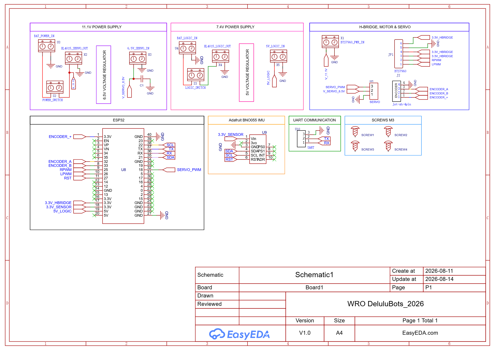
  <br>
  <em>Official electrical schematic detailing power distribution and signal routing.</em>
</p>

#### Dual-Battery Domain Isolation

To eliminate voltage dips (brownouts) and inductive noise caused by high-current motor actuation, the electrical system is divided into two fully isolated power domains:

* **Logic & Perception Domain (7.4V LiPo, 2500 mAh 2S):** Powers low-voltage digital hardware, sensors, processing boards, and the USB camera.
* **Actuator Domain (11.1V LiPo, 2300 mAh 3S):** Supplies raw current to mechanical loads, isolating inductive back-EMF and switching noise from sensitive processing logic.

```text
┌────────────────────────────────────────────────────────────────────────┐
│                        ACTUATOR POWER DOMAIN                           │
└────────────────────────────────────────────────────────────────────────┘
                       ┌──────────────────────┐
                       │   11.1 V LiPo        │
                       │   2300 mAh (3S)      │
                       └──────────┬───────────┘
                                  │
                   ┌──────────────┴──────────────┐
                   │                             │
              Direct 11.1 V                 ┌────▼────┐
                   │                        │ XL4015  │
                   ▼                        │  6.5 V  │
             ┌───────────┐                  └────┬────┘
             │  BTS7960  │                       │
             └─────┬─────┘                  ┌────┴─────┐
                   │                        │ Hiwonder │
                   ▼                        │ 20kg·cm  │
              ┌─────────┐                   │  Servo   │
              │ GM25    │                   └───────────┘
              │ Motor   │
              └─────────┘

┌────────────────────────────────────────────────────────────────────────┐
│                          LOGIC POWER DOMAIN                            │
└────────────────────────────────────────────────────────────────────────┘
                       ┌──────────────────────┐
                       │   7.4 V LiPo         │
                       │   2500 mAh (2S)      │
                       └──────────┬───────────┘
                                  │
                             ┌────▼────┐
                             │ XL4015  │
                             │  5.0 V  │
                             └────┬────┘
                                  │
                    ┌─────────────┴─────────────┐
                    │                           │
              ┌─────▼─────┐               ┌─────▼─────┐
              │   ESP32   │               │ Raspberry │
              └─────┬─────┘               │   Pi 5    │
                    │                     └─────┬─────┘
       ┌────────────┼────────────┐              │
       │            │            │          USB │
   ┌───▼────┐  ┌────▼───┐  ┌─────▼─────┐        ▼
   │Encoder │  │ BNO055 │  │   UART    │  ┌───────────────┐
   │        │  │  IMU   │  │ Interface │  │ Logitech Brio │
   └────────┘  └────────┘  └───────────┘  │  100 Webcam   │
                                          └───────────────┘
```

> [!IMPORTANT]
> **Noise Suppression:** A 220 nF ceramic capacitor is placed in parallel across the servo power rail (+V/GND) to suppress high-frequency inductive voltage spikes generated by sudden mechanical steering shifts.

#### Voltage Regulation & Pre-Power Safeguards

Two XL4015 DC-DC Buck Converters step down variable battery voltages into regulated power rails:

| **Input Source** | **Regulated Output** | **Target Payloads** | **Primary Purpose** |
| --- | --- | --- | --- |
| **7.4V LiPo (2S, 2500 mAh)** | **5.0V DC** | ESP32, Raspberry Pi 5, Sensors, Camera | Clean digital rail preventing MCU/SBC brownouts. |
| **11.1V LiPo (3S, 2300 mAh)** | **6.5V DC** | Hiwonder 20 kg·cm Steering Servo | Dedicated high-torque servo rail isolated from logic. |

> [!WARNING]
> **Safety Protocol:** Buck converter output voltages are manually verified using a digital multimeter prior to connecting any microcontrollers, ensuring no over-voltage reaches 5V sensitive logic lines.
>
> | **Testing Logic Rail (5.0V)** | **Testing Actuator Rail (6.5V)** |
> | :---: | :---: |
> |  |  |
---

### Reliability and Safety Considerations

#### Reverse Polarity Prevention

One of the most critical foreseeable assembly failures during rapid pit-stop battery swaps is reverse polarity connection. To eliminate this risk, the power distribution system does not rely solely on color-coded wire conventions (red/black):

* **Actuator Domain (11.1 V LiPo):** Terminates in a high-current **keyed XT60 connector**.
* **Logic Domain (7.4 V LiPo):** Terminates in a dedicated **keyed JST-RC connector**.

Because both connector families are mechanically polarized and asymmetrical, they physically prevent inverted insertion. This implements a reliable mistake-proofing (poka-yoke) physical safeguard, eliminating human error during high-stress competition maintenance.

---

### Current Requirements & Power Budget

#### Component Current Demand Matrix

| **Component** | **Operating Voltage** | **Current Demand / Profile** | **Supply Source** |
| --- | --- | --- | --- |
| **GM25-370 Motor** | 11.1 V | ≤ 1.7 A (Nominal) \| ≤ 5.6 A (Stall) | Direct 11.1V LiPo (3S, 2300 mAh) |
| **BTS7960 Driver** | 11.1 V | Rated up to 43 A max peak | Direct 11.1V LiPo (3S, 2300 mAh) |
| **Hiwonder Servo** | 6.5 V | Variable dynamic load (≈ 0.8 A – 2.0 A) | 11.1V LiPo → XL4015 Buck (#2) |
| **Raspberry Pi 5** | 5.0 V | High-performance digital load (≈ 1.5 A – 3.0 A) | 7.4V LiPo → XL4015 Buck (#1) |
| **ESP32 MCU** | 5.0 V | Nominal logic load (≈ 160 mA – 240 mA) | 7.4V LiPo → XL4015 Buck (#1) |
| **BNO055 IMU** | 3.3 V Logic | Low power sensor load (< 15 mA) | ESP32 Onboard 3.3V Regulator |
| **Logitech Brio 100** | 5.0 V (USB) | Powered directly via USB bus | Raspberry Pi 5 USB Port |

#### Mathematical Power Calculations

Electrical power consumption is defined by:

**P = V × I**

**1. Nominal Motor Power Consumption:**
P(motor_nom) = 11.1 V × 1.7 A = 18.87 W

**2. Worst-Case Stall Electrical Condition:**
P(motor_stall) = 11.1 V × 5.6 A = 62.16 W

*The stall power (62.16 W) represents an instantaneous transient condition used to dimension PCB trace widths and thermal clearance margins.*

#### Battery Runtime Estimation

Theoretical operational runtime (t) is estimated using nominal battery capacities:

**t ≈ Capacity (Ah) / Average Current (A)**

* **Actuator Rail (11.1V LiPo, 2300 mAh):**
  Actuator Runtime ≈ 2.3 Ah / 1.7 A ≈ 1.35 hours (≈ 81 minutes)

* **Logic Rail (7.4V LiPo, 2500 mAh):**
  Logic Runtime ≈ 2.5 Ah / 2.0 A ≈ 1.25 hours (≈ 75 minutes)

> **Real-World Operating Margin:** Accounting for ≈ 90% DC-DC buck efficiency, CPU vision spikes, and keeping battery discharge above 20% capacity (3.3V/cell cutoff), total continuous competition runtime is estimated at **45–55 minutes**, far exceeding the required competition run length.

---

### Component Selection & Specifications

The following table details the key electronic and electromechanical components selected for our vehicle, including their core technical parameters, functional role, power/interface requirements, and engineering rationale.

<table>
  <thead>
    <tr>
      <th width="11%">Component</th>
      <th width="8%">Image</th>
      <th width="20%">Key Specifications</th>
      <th width="16%">Function</th>
      <th width="20%">Power / Interface</th>
      <th width="25%">Selection Rationale</th>
    </tr>
  </thead>
  <tbody>
    <tr>
      <td><b>GM25-370 Geared Motor</b><br><i>(with encoder)</i></td>
      <td align="center">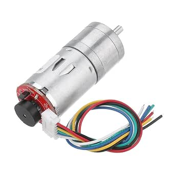</td>
      <td>
        • 12V Nominal<br>
        • 330 RPM<br>
        • Metal Gearbox<br>
        • Integrated Encoder
      </td>
      <td>Drive Propulsion</td>
      <td>11.1V Battery via BTS7960 Driver</td>
      <td>Provides high torque and high encoder resolution for precise closed-loop speed control.</td>
    </tr>
    <tr>
      <td><b>BTS7960 Motor Driver</b></td>
      <td align="center">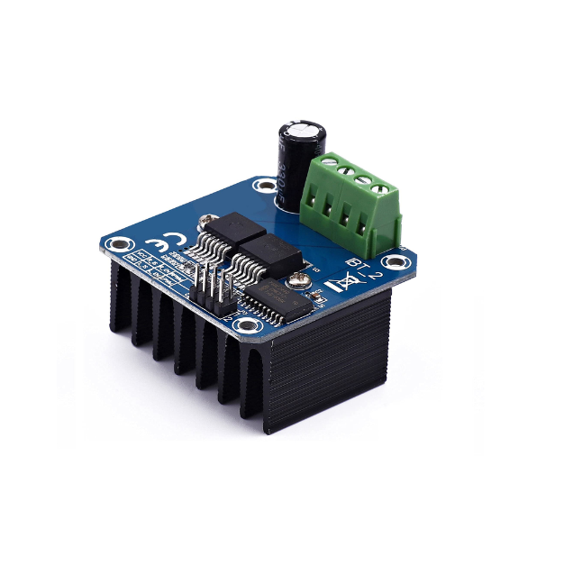</td>
      <td>
        • Max Current: 43A<br>
        • Operating Voltage: 6V–27V<br>
        • Thermal Protection
      </td>
      <td>High-Current Motor Control</td>
      <td>11.1V Power Rail + ESP32 Logic PWM/DIR</td>
      <td>Offers high current headroom, preventing thermal shutdown during heavy load or acceleration.</td>
    </tr>
    <tr>
      <td><b>Hiwonder Digital Servo</b></td>
      <td align="center">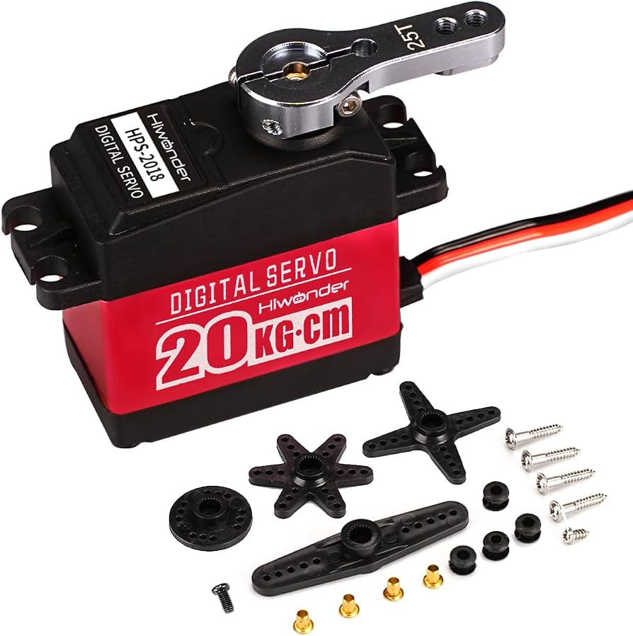</td>
      <td>
        • Torque: 20 kg·cm<br>
        • Metal Gears<br>
        • Fast Response
      </td>
      <td>Steering Actuation</td>
      <td>6.5V Regulated Power Rail (PWM Control)</td>
      <td>Metal gears and high torque ensure rigid steering alignment without mechanical backlash.</td>
    </tr>
    <tr>
      <td><b>ESP32 Dev Board</b></td>
      <td align="center">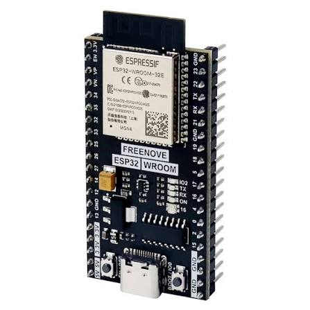</td>
      <td>
        • Dual-Core 240MHz<br>
        • Wi-Fi / Bluetooth<br>
        • Hardware PWM
      </td>
      <td>Low-Level Microcontroller</td>
      <td>5V Regulated Logic Input (UART / I2C)</td>
      <td>High processing speed for real-time encoder readings and PID motor loops.</td>
    </tr>
    <tr>
      <td><b>BNO055 9-DOF IMU</b></td>
      <td align="center">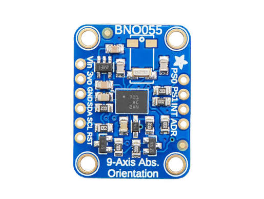</td>
      <td>
        • Onboard Sensor Fusion<br>
        • Absolute Orientation<br>
        • Low Drift
      </td>
      <td>Orientation Feedback</td>
      <td>ESP32 via I2C Bus</td>
      <td>Built-in sensor fusion algorithm offloads IMU filtering from the main MCU.</td>
    </tr>
    <tr>
      <td><b>Raspberry Pi 5</b></td>
      <td align="center">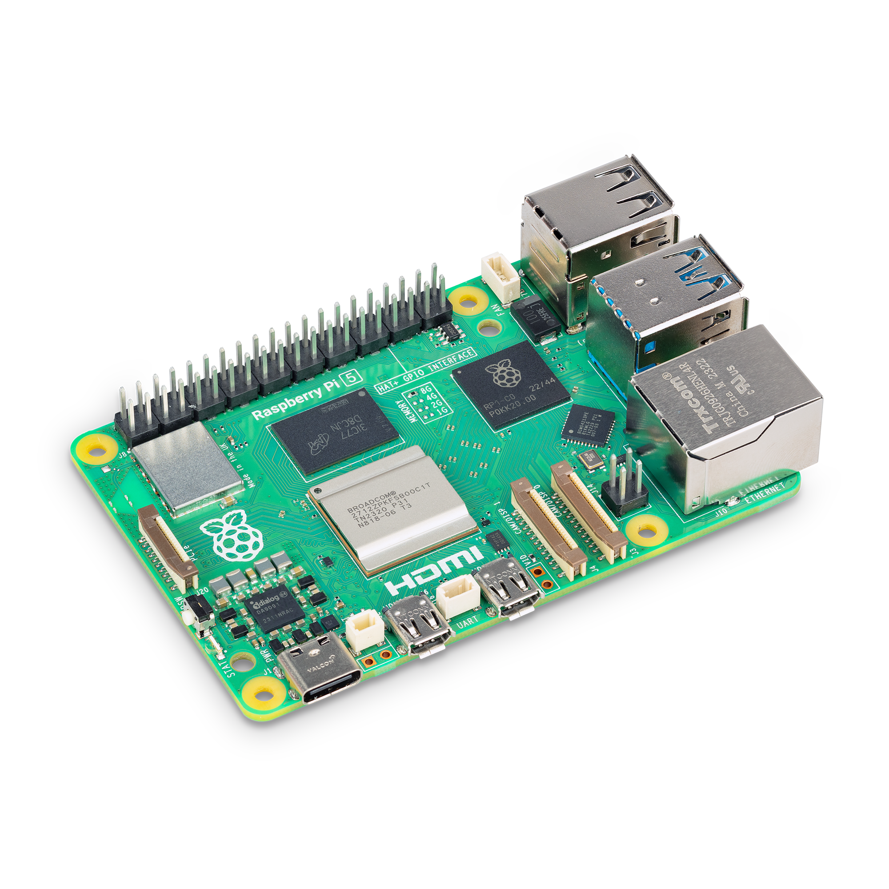</td>
      <td>
        • Quad-Core ARM<br>
        • 16GB RAM<br>
        • USB 3.0
      </td>
      <td>High-Level Vision Processing</td>
      <td>5V Regulated Logic Rail (USB/UART Interface)</td>
      <td>Delivers high computational power and memory for real-time OpenCV image processing.</td>
    </tr>
    <tr>
      <td><b>Logitech Brio 100</b></td>
      <td align="center">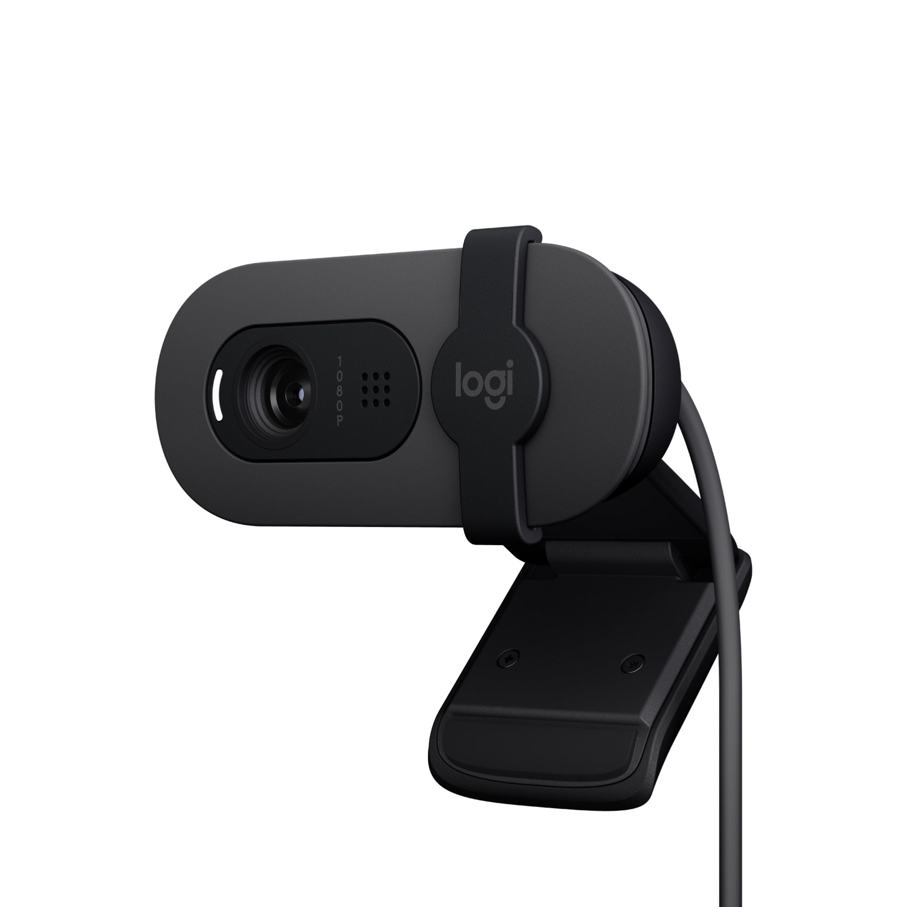</td>
      <td>
        • 1080p Resolution<br>
        • Wide FOV<br>
        • Auto Light Balance
      </td>
      <td>Computer Vision Camera</td>
      <td>USB Connection to Raspberry Pi 5</td>
      <td>Provides high clarity and stable frame rates across varying ambient light conditions.</td>
    </tr>
    <tr>
      <td><b>XL4015 Buck Converters</b></td>
      <td align="center">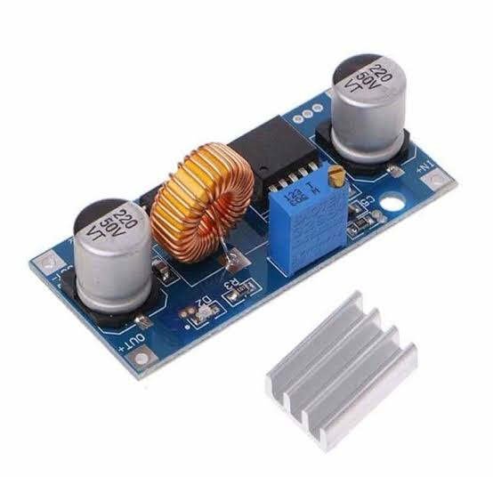</td>
      <td>
        • Max Output: 5A / 50W<br>
        • Adjustable Step-Down<br>
        • High Efficiency (>90%)
      </td>
      <td>Power Step-Down (Logic & Servo)</td>
      <td>Battery → Regulated Rails</td>
      <td>Drives logic circuits and servos efficiently with low heat dissipation.</td>
    </tr>
  </tbody>
</table>

---

### Strategic Component Placement (Physical Layout)

Component placement bridges our electrical schematic with the mechanical reality of the chassis. Positioning was dictated by three core constraints: **signal integrity (minimizing wire length)**, **electromagnetic interference (EMI) reduction**, and **accessibility for quick pit-stop maintenance**.

<p align="center">
  
  <br>
  <em>Final logic PCB physically mounted on the vehicle chassis.</em>
</p>

| **Component** | **Physical Placement** | **Engineering Rationale** |
| :--- | :--- | :--- |
| **ESP32 & BNO055 IMU** | Centered directly on carrier PCB | Keeps I²C / signal traces extremely short to prevent noise. Rigid PCB mounting ensures the IMU reads true chassis kinematics without vibration anomalies. |
| **BTS7960 Motor Driver** | Rear chassis, adjacent to motor | Keeps high-current motor wiring as short as possible, reducing voltage drop (I²R losses) and keeping inductive motor noise away from the logic boards. |
| **XL4015 Regulators** | Segregated near battery inputs | Steps down voltage immediately at the source, reducing unnecessary runs of raw 11.1V/7.4V lines across the chassis. |
| **Battery Connectors** | PCB outer edges | Ensures rapid, unobstructed access for battery hot-swapping between competition runs. |
| **Servo Header** | Accessible PCB perimeter | Allows for quick steering actuator replacement without needing to disassemble or unmount the entire logic board. |
| **Raspberry Pi 5** | Elevated deck, isolated from motors | Physically distances sensitive high-speed logic from motor EMI and provides better ambient airflow for CPU cooling. |

#### Sensor Kinematics & Field Geometry

Beyond electrical routing, sensor placement was strictly optimized to map the physical geometry of the WRO competition field accurately:

* **Camera (Perception & FOV):** Positioned at the highest frontal point to maximize look-ahead detection distance while eliminating structural blind spots. Its final pitch angle was empirically calibrated on the physical track to mitigate harsh overhead lighting reflections, floor shadows, and horizon distortion.
* **BNO055 IMU (Orientation):** Hard-mounted to perfectly align with the vehicle’s longitudinal axis. This precise orientation guarantees that yaw calculations reflect the chassis's true kinematic center without introducing angular offsets.
* **Quadrature Encoder (Odometry):** Mechanically coupled directly to the drive motor shaft. This 1:1 rigid coupling ensures that wheel rotation is translated into precise linear distance data, minimizing errors caused by mechanical backlash.

---

### Iterative Design Process

The final custom PCB was the result of a systematic iteration process. Before manufacturing the final board, the complete electrical system was assembled using temporary wire harnesses and tested directly on the physical robot chassis under dynamic loads. This allowed us to identify electrical bottlenecks and mechanical constraints before committing to a permanent copper layout.

<p align="center">
  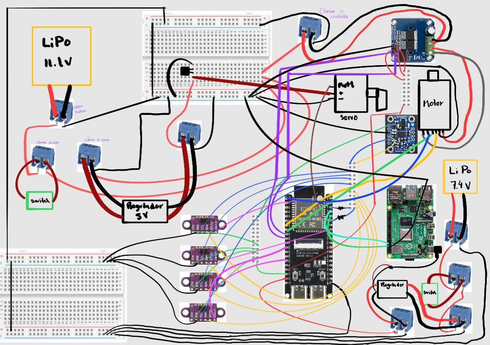
  &nbsp;&nbsp;
  
  <br>
  <em>Left: Initial hand-drawn circuit mapping. Right: Breadboard logic validation before PCB design.</em>
</p>

#### Evolution of the Electrical Schematic

Our electrical mapping evolved to address noise constraints and incorporate dual battery isolation.

<p align="center">
  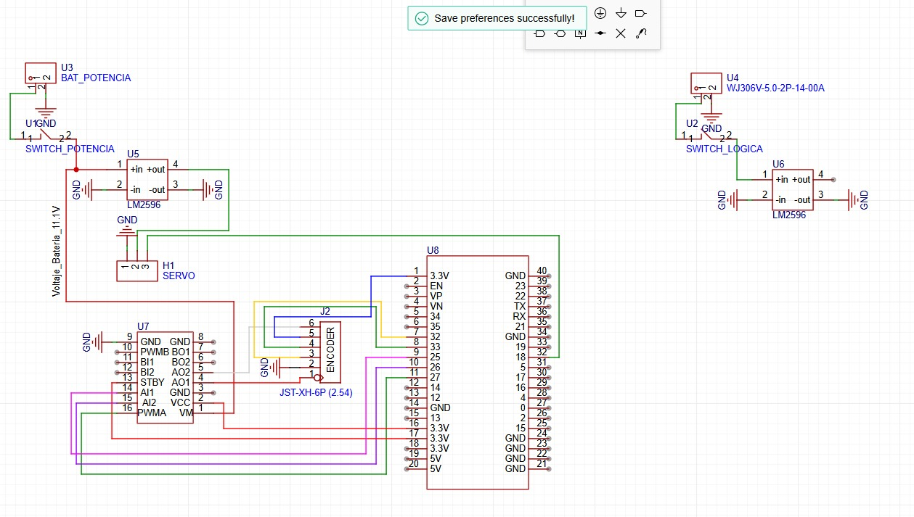
  &nbsp;&nbsp;
  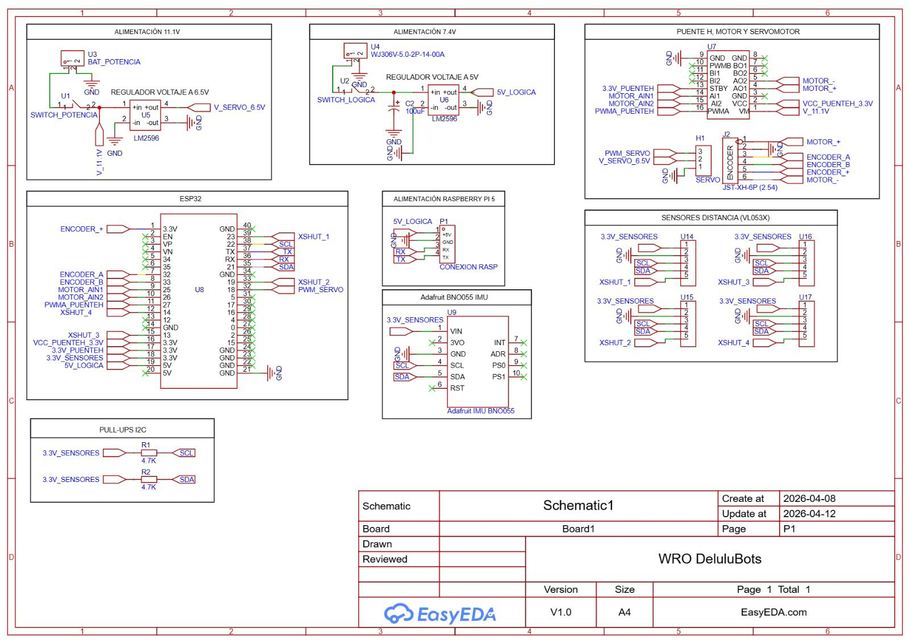
  <br>
  <em>Earlier revisions of the system architecture (v1 and v2) during the prototyping phase.</em>
</p>

#### Hardware Iteration Matrix

| **Observation / Issue** | **Design Change Implemented** | **Expected Improvement** |
| :--- | :--- | :--- |
| **Spaghetti Wiring:** Loose temporary wires made connections fragile and difficult to organize. | **Custom Carrier PCB:** Designed a dedicated two-layer printed circuit board. | Achieved highly organized, vibration-resistant, and reproducible wiring. |
| **Brownouts:** Actuator loads (motors/servos) caused voltage drops affecting the Pi and ESP32. | **Dual-Domain Battery System:** Divided the system into two physically isolated battery domains. | Prevented MCU resets by physically decoupling logic from inductive loads. |
| **Voltage Risks:** Buck regulators required precise manual adjustment via potentiometers. | **Pre-Power Validation Step:** Enforced manual multimeter checks of XL4015 outputs before IC insertion. | Eliminated the risk of frying 5V logic lines with accidental 11V inputs. |
| **Human Error:** Standard pin headers allowed for accidental reverse polarity during battery swaps. | **Keyed Connectors:** Transitioned to XT60 and keyed JST connectors for power delivery. | Made it physically impossible to plug batteries in backward during the stress of competition. |
| **Signal Routing:** Multiple loose signal jumper wires were difficult to manage and trace. | **Centralized JST Headers:** Grouped signal lines into dedicated JST-XH headers on the PCB. | Faster assembly, easier module replacement, and simplified troubleshooting. |

---

### Custom PCB Design & Integration

The printed circuit board was engineered to transform the electrical ecosystem from a fragile prototype into a competition-ready, reproducible system. Rather than relying on independent wiring, the PCB acts as the central nervous system, providing dedicated power distribution planes, shielded signal traces, and secure component mounting.

<p align="center">
  
  &nbsp;&nbsp;
  
  <br>
  <em>Left: Initial prototype board layout. Right: Final competition-ready custom PCB 3D model.</em>
</p>

#### PCB Architecture Decisions

| **Feature** | **Design Decision** | **Engineering Rationale** |
| :--- | :--- | :--- |
| **Structure** | Two-Layer PCB (FR4) | Provides adequate routing flexibility while keeping the board footprint compact. |
| **Grounding** | Common Ground Plane (Polygon Pour) | Ensures a unified electrical reference for control/communication, reducing ground loops. |
| **Power Distribution** | Dedicated Power Rails | Replaces unpredictable wire resistance with calculated copper paths, simplifying debugging. |
| **Motor Driver** | External BTS7960 Module | Offloads extreme thermal dissipation (up to 43A) away from the main PCB logic. |
| **ESP32 & IMU** | Direct PCB Surface Mounting | Minimizes I²C wire length for the BNO055, reducing noise and capacitance on the data lines. |
| **Power Inputs** | KF301-2P Terminals | Provides robust, high-current mechanical clamping for raw battery inputs. |

#### PCB Trace Width Optimization

To guarantee electrical safety and prevent copper delamination under heavy loads, trace widths were dynamically calculated rather than uniformly applied. 

Using standard **IPC-2221 design formulas**, we dimensioned the power traces based on expected temperature rise and current flow. Special attention was given to the actuator power paths: because the GM25 motor can hit a **stall current of up to 5.6 A**, those specific traces were significantly widened and reinforced with copper pours to ensure they can handle transient spikes without dangerous thermal buildup. Signal traces (like UART and I²C), which carry milliamperes, were kept thin to save routing space.

---

### Systematic Sensor Calibration Protocols

Systematic sensor calibration is conducted before executing autonomous runs to verify that all sensor readings reliably represent the vehicle's true physical state on the competition field.

| **Subsystem** | **Calibration Method** | **Validation Purpose** |
| :--- | :--- | :--- |
| **BNO055 IMU** | Stationary zero-bias initialization & axis verification | Establishes a true, drift-free angular heading reference. |
| **Motor Encoder** | Ground-truth linear translation measurement | Validates wheel ticks-to-distance odometry scaling factors. |
| **Logitech Brio Camera** | Visual pipeline tuning under ambient arena lighting | Maximizes detection accuracy, contrast, and color thresholding. |
| **Steering Servo** | Commanded PWM pulse width vs. physical steering angle | Eliminates mechanical backlash and ensures centered tracking. |

#### BNO055 Orientation Calibration
During bootup, the vehicle remains completely stationary for three seconds. This permits the onboard sensor fusion co-processor to zero its internal rate gyros, compute accelerometer gravity vectors, and establish an absolute zero heading aligned with the track direction.

#### Encoder Odometry Calibration
Odometry scaling factors are verified by commanding the vehicle to travel an exact distance measured physically on the field. Encoder counts are recorded over multiple iterations to determine the real-world pulse-to-distance conversion ratio, compensating for slight wheel diameter variations and tire compression.

#### Vision System & Environmental Lighting Calibration
Vision calibration verifies camera pitch, Field of View (FOV), exposure, and HSV color thresholds directly on the practice mat. The camera exposure is manually locked to prevent auto-adjusting shutter speeds under fluctuating venue lighting, preventing false line detections from floor glare and shadows.
## 5. Software

### 5.1. Computer Vision

#### HSV calibration

##### Overview

Reliable color detection is essential for autonomous navigation. Different lighting conditions can significantly alter the appearance of objects on the field, making fixed color values unsuitable.

To solve this problem, a calibration tool was developed to adjust and store HSV ranges for each element of the competition.

The tool allows users to tune the HSV thresholds in real time and immediately visualize the resulting mask.

---

##### Calibration Interface

The interface includes:

- HSV sliders.
- Real-time camera preview.
- Binary mask visualization.
- Configuration saving.

Each color can be adjusted independently.

---

##### Calibration Workflow

```text
┌──────────────────────────┐
│       Camera Frame       │
└────────────┬─────────────┘
             │
             ▼
┌──────────────────────────┐
│      HSV Conversion      │
└────────────┬─────────────┘
             │
             ▼
┌──────────────────────────┐
│  Threshold Adjustment    │
└────────────┬─────────────┘
             │
             ▼
┌──────────────────────────┐
│      Mask Preview        │
└────────────┬─────────────┘
             │
             ▼
┌──────────────────────────┐
│    Save Configuration    │
└──────────────────────────┘
```

---

##### HSV Color Space

The calibration system converts each frame from BGR to HSV:

```python
hsv = cv2.cvtColor(frame, cv2.COLOR_BGR2HSV)
```

HSV was selected because it separates color information from illumination, allowing the system to adapt more easily to different environments.

---

##### Mask Generation

The binary mask is generated using:

```python
mask = cv2.inRange(
    hsv,
    np.array(low),
    np.array(high)
)
```

Pixels inside the selected range are preserved, while all other pixels are discarded.

---

##### Configuration Storage

The calibrated HSV ranges are stored in:

```text
config/
└── saved_ranges.py
```

These values are later loaded by the vision pipeline and used during obstacle detection and navigation.

##### Detection Examples

###### Red Signs

| Threshold Adjustment | Saving Configuration | Generated Mask |
| :---: | :---: | :---: |
|  |  |  |

---

###### Green Signs

| Threshold Adjustment | Saving Configuration | Generated Mask |
| :---: | :---: | :---: |
|  |  |  |

---

###### Blue Lines

| Threshold Adjustment | Saving Configuration | Generated Mask |
| :---: | :---: | :---: |
|  |  |  |

---

###### Orange Lines

| Threshold Adjustment | Saving Configuration | Generated Mask |
| :---: | :---: | :---: |
|  |  |  |

---

###### Parking Walls

| Threshold Adjustment | Saving Configuration | Generated Mask |
| :---: | :---: | :---: |
|  |  |  |

---

###### White Space

| Threshold Adjustment | Saving Configuration | Generated Mask |
| :---: | :---: | :---: |
|  |  |  |

#### Element detection

##### Overview

The computer vision system processes the images captured by the camera and detects the different elements present on the competition field.

The HSV ranges used by the detection algorithms are generated using the calibration tool described in [`calibration`](#hsv-calibration).

The system currently detects:

- Red signs.
- Green signs.
- Blue lines.
- Orange lines.
- Pink parking walls.
- Track space.

---

##### Vision Pipeline

```text
┌──────────────────────────┐
│       Camera Frame       │
└────────────┬─────────────┘
             │
             ▼
┌──────────────────────────┐
│      HSV Conversion      │
└────────────┬─────────────┘
             │
             ▼
┌──────────────────────────┐
│      Color Filtering     │
└────────────┬─────────────┘
             │
             ▼
┌──────────────────────────┐
│ Morphological Operations │
└────────────┬─────────────┘
             │
             ▼
┌──────────────────────────┐
│    Contour Detection     │
└────────────┬─────────────┘
             │
             ▼
┌──────────────────────────┐
│ Bounding Box Generation  │
└────────────┬─────────────┘
             │
             ▼
┌──────────────────────────┐
│     Target Selection     │
└──────────────────────────┘
```

---

##### Detection

The `process_elements()` method performs the detection process for signs and lines.

For each frame:

1. The image is converted to HSV.
2. A binary mask is generated.
3. Morphological operations remove noise.
4. Contours are extracted.
5. Small contours are discarded.
6. A target element is selected.

Each detected element stores:

- Color.
- Binary mask.
- Contour.
- Area.
- Bounding rectangle.

---

##### Sign Detection

Red and green signs are processed using:

```python
VisionUtils.select_target_pillar()
```

The selected target is determined according to:

1. Contour area.
2. Vertical position.

When both signs have similar areas, the sign located lower in the image is considered closer to the robot.

---

##### Line Detection

Blue and orange lines are processed using:

```python
VisionUtils.select_target_line()
```

Unlike signs, line detection prioritizes the vertical position because perspective distortion affects their apparent size.

If both lines are located at similar heights, contour area is used as a secondary criterion.

---

##### Track Detection

Track detection uses a different pipeline.

Before processing, red and green objects are replaced to avoid interference:

```python
image = VisionUtils.replace_color(
    frame,
    saved_ranges.color_ranges,
    ["Red", "Green"]
)
```

The image then follows the following steps:

```text
┌──────────────────────────┐
│          Resize          │
└────────────┬─────────────┘
             │
             ▼
┌──────────────────────────┐
│   Grayscale conversion   │
└────────────┬─────────────┘
             │
             ▼ 
┌──────────────────────────┐
│    Bilateral filtering   │
└────────────┬─────────────┘
             │
             ▼    
┌──────────────────────────┐
│       Thresholding       │
└────────────┬─────────────┘
             │
             ▼       
┌──────────────────────────┐
│  Morphological closing   │
└────────────┬─────────────┘
             │
             ▼    
┌──────────────────────────┐
│     Largest countour     |
|        extraction        │
└──────────────────────────┘
```

The largest valid contour is preserved and used as the track representation.

---

##### Software Structure

```text
ImageManager
    │
    ├── process_walls()
    ├── process_elements()
    ├── show_results()
    ├── run_test()
    └── run_test_from_image()

VisionUtils
    │
    ├── detect_element()
    ├── select_target_pillar()
    ├── select_target_line()
    ├── draw_element()
    ├── keep_largest_white()
    └── replace_color()
```

### 5.2. Vehicle Control

#### Obstacle challenge logic
#### Lap counting
#### Parking procedure

## 6. DIY Game Field


To test our autonomous vehicle under conditions closer to the actual competition, we decided to build our own full-scale game field. Having a field available for regular testing allowed us to work on autonomous navigation, computer vision, obstacle detection, and parking. Our goal was to build a field that followed the main WRO specifications while keeping it affordable, reusable, and easy to modify between tests.

---

### Materials and Budget

The total estimated cost was approximately **$50.84 USD**.

| Material | Qty | Cost (USD) | Store / Reference Link |
| :--- | :--- | :--- | :--- |
| **White Tarpaulin** (3x3m min) | 1 | $17.58 | [MercadoLibre](https://www.mercadolibre.com.mx/pared-de-3-lados-9m-para-carpa-toldo-3x3-impermeable-uv-blanco/p/MLM51398001) |
| **3mm MDF Panel** (1.22 x 2.44m) | 1 | $9.73 | [Home Depot](https://www.homedepot.com.mx/p/arauco-panel-de-mdf-3-mm-122-x-244-m-arauco-trupan-286133) |
| **Matte Black Paint for Wood** (1L) | 1 | $6.19 | Local Hardware Store |
| **Panduit ST17 Orange Tape** | 1 | $3.83 | [MercadoLibre](https://www.mercadolibre.com.mx/cinta-aislante-panduit-naranja-st17-075-66or-pvc-2012m-x-19mm/p/MLM47125027) |
| **TUK Vinyl Blue Tape** | 1 | $1.30 | [Home Depot](https://www.homedepot.com.mx/p/tuk-cinta-aislante-electrica-de-vinilo-19-mm-x-18-m-az-345325-121543) |
| **Acrylic Paint** (Magenta, Red, Green)| 3 | $6.90 | Office Depot |
| **Grey Sharpie Marker** | 1 | $1.89 | Office Depot |
| **Paint Roller & 1" Foam Brush** | 2 | $3.42 | Local Hardware Store / Home Depot |

> **Budget Tip:** We got our tarpaulin for free from a local print shop that was discarding it, so it's worth asking around before buying new.
---

### Step-by-Step Construction Guide

Each part of the field was designed to be inexpensive, easy to assemble, and reusable for future testing.

#### 1. Base Mat

The official field has an inner playing area of **3000 × 3000 mm**. We used a white tarpaulin as the base surface because it was inexpensive, easy to handle, and easy to store after testing.

---

#### 2. Exterior and Interior Walls


> **Material:** 3 mm MDF  
> **Height:** 100 mm  
> **Color:** Matte black

**Exterior Walls**

Since the MDF sheet is 2440 mm long and the required wall length is 3000 mm, each exterior wall was divided into two **1500 mm sections**.

The sections were connected using custom wooden puzzle joints glued to the back of the panels. The same method was used to secure the 90-degree corners.

*This allowed us to achieve the required wall length without needing a larger MDF sheet.*

**Interior Walls**

The interior walls were built as modular segments so they could be rearranged for different configurations. All interior-facing walls were painted matte black.

Because the MDF is 3 mm thick, the short segments were reduced by **2 × 3 mm** to account for the thickness of the perpendicular walls:

| Segment | Quantity | Length |
|---|---:|---:|
| Long | 2 | 1000 mm |
| Long | 2 | 1400 mm |
| Long | 2 | 1800 mm |
| Short | 2 | 994 mm |
| Short | 2 | 1394 mm |
| Short | 2 | 1794 mm |

---

#### 3. Traffic Signs & Parking Delimiters


We used leftover 3 mm MDF from the wall construction to build both the traffic signs and parking delimiters as hollow structures. This reduced material usage while keeping the required external dimensions.

**Traffic Signs**

**50 × 50 × 100 mm** · **3 mm MDF** · **Red / Green**

**Cut list per sign:**
- 4 × 100 × 50 mm rectangles
- 2 × 50 × 50 mm caps

**Parking Delimiters**

**200 × 20 × 100 mm** · **3 mm MDF** · **Magenta**

**Cut list per delimiter:**
- 2 × 200 × 100 mm rectangles
- 2 × 20 × 100 mm rectangles
- 2 × 200 × 20 mm caps

> **Important:** When calculating the pieces for the hollow structures, account for the 3 mm MDF thickness to keep the final dimensions correct.

---

#### 4. Lines and Markings

The field requires **20 mm orange and blue lines**, along with thinner grey markings for the starting areas.

We initially tried painting the colored lines directly onto the tarpaulin, but the paint bled through the fabric. We switched to electrical tape instead:

- **Orange:** Panduit ST17
- **Blue:** TUK Vinyl Tape
- **Width:** close to the required 20 mm

The tape provided cleaner and more consistent lines, which was particularly important for our computer vision system.

The smaller markings and starting zones were measured and drawn manually using a ruler and grey Sharpie.

> **Design choice:** Electrical tape gave us cleaner edges and more consistent line widths than paint, making the field markings easier for our computer vision system to detect.

---

### Construction Process Gallery

| 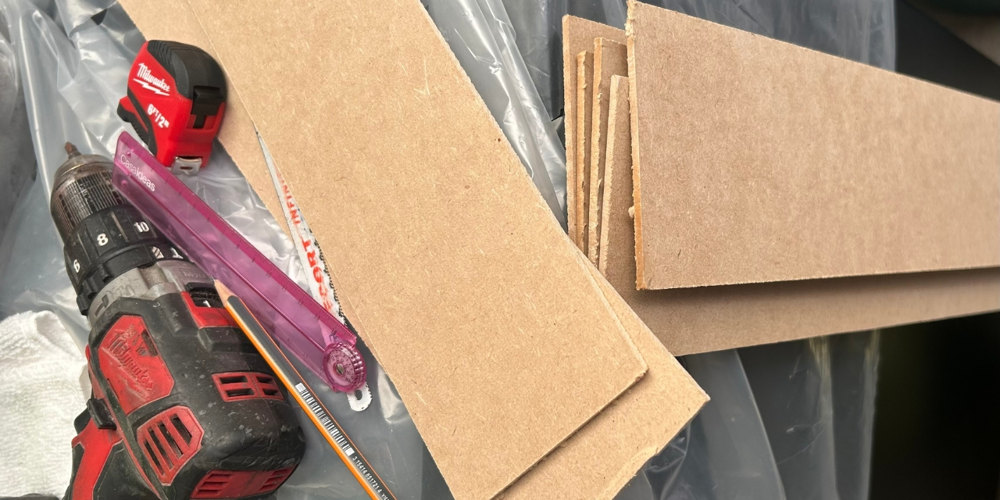 |  |
| :---: | :---: |
| **1.** Cutting MDF strips and assembling the exterior wall joints. | **2.** Preparing the modular interior wall segments. |
|  |  |
| **3.** Building and painting the traffic signs and parking delimiters. | **4.** Measuring and applying the field lines and markings. |

The finished field became part of our regular testing setup, giving us a consistent environment to test changes to the robot and compare their results.

## 7. License
