WRO 2026 Future Engineers - DeluluBots
====

## Table Of Contents
1. [Team](#1-team)
2. [Challenge Overview](#2-challenge-overview)
3. [Our Robot](#3-our-robot)
4. [Hardware](#4-hardware)
    * 4.1. [Mobility Management](#41-mobility-management)
    * 4.2. [Power and Sense Management](#42-power-and-sense-management)
5. [Software](#5-software)
    * 5.1. [Computer Vision](#51-computer-vision)
    * 5.2. [Vehicle Control](#52-vehicle-control)
6. [DIY Game Field](#6-diy-game-field)  
7. [License](#7-license)

## 1. Team

<p align="center">
  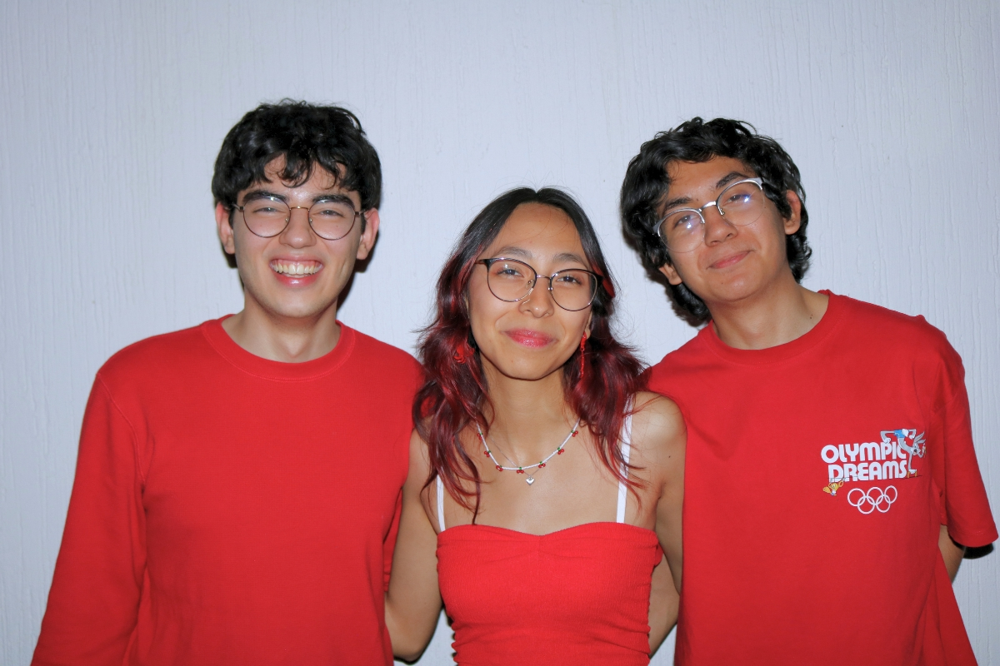
</p>

<p align="center">
  <strong>DELULUBOTS</strong><br>
  <em>Delulu Today, Limitless Tomorrow.</em>
</p>

We are **DeluluBots**, an independent robotics team of students passionate about **robotics, programming, electronics, and innovation**.

**DeluluBots was born from a simple but ambitious dream: to build our own robot and compete in WRO.** At the beginning, it seemed like a delulu idea—we had limited resources, little experience with many of the technologies involved, and no clear way to afford the journey ahead. But instead of seeing those limitations as a reason to stop, we saw them as a reason to start. That mindset became the foundation of our team.

> *Delulu* is an informal term for being “delusional” in an optimistic way: believing in something that may seem unrealistic and choosing to pursue it anyway.

Our journey is guided by one simple idea: **“Delulu Today, Limitless Tomorrow.”** As an independent team, we have worked hard to build a competitive robot while finding ways to make our participation possible. To help cover the costs of our robot and our trip to the national competition, we started **selling homemade cookies and spicy gummy candies in our city**. Every sale brought us one step closer to our goal.

More than building a robot, we aim to grow as people and engineers capable of **creating, innovating, and turning ideas into reality**. WRO has encouraged us to learn beyond what we are normally taught at university, explore technologies we had never worked with, and solve challenges independently.

Through every failure and iteration, we have learned that **perseverance is just as important as technical knowledge**. We are proud of how far we have come and excited to keep learning, improving, and staying *delulu*.

---

### Best & Fun Moments

<p align="center">
  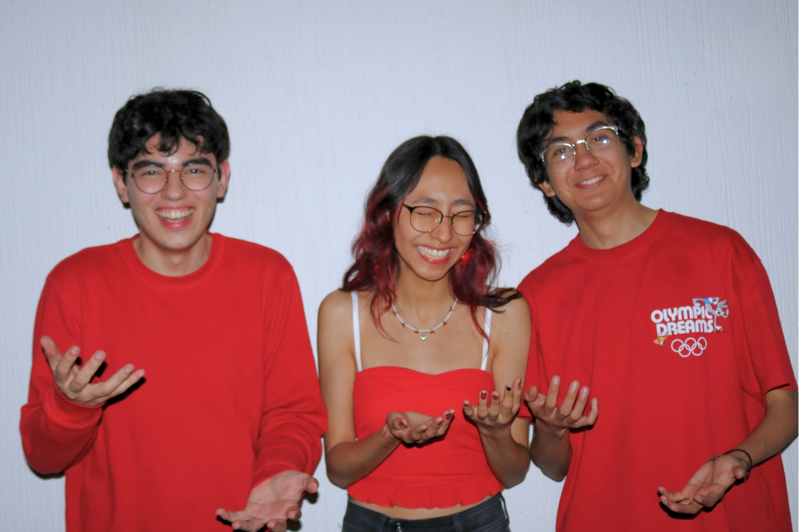
  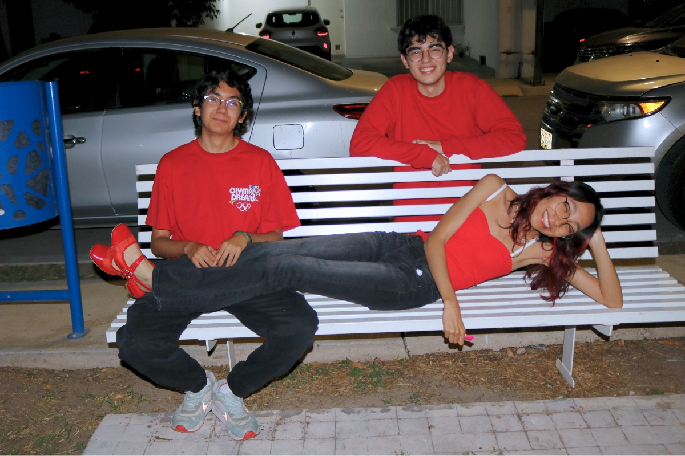
</p>

<p align="center">
  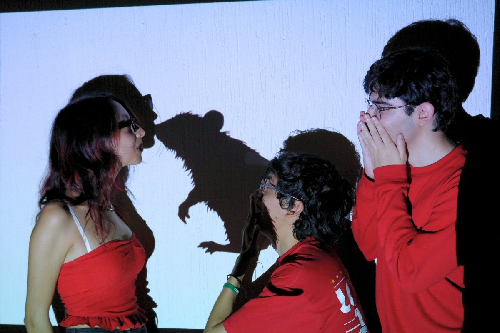
  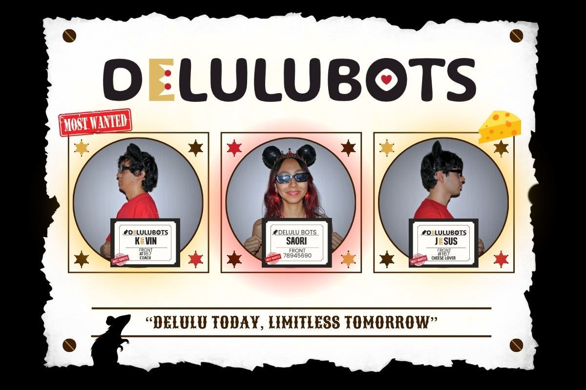
</p>

---

### Team Members

<table>
<tr>
<td width="65%" valign="top">

## **Saori Jasso**

**Electronics · PCB Designer · Software Developer**

**Age:** 19

I am an **Information Technology Engineering student** and was responsible for the robot’s electrical system, from **selecting components and designing the PCB** to developing the systems that allow it to power on with just two buttons.

I also contributed to the **software development** and was responsible for **designing and building our DIY Game Field** for testing and practice.

WRO gave me the opportunity to design my **first PCB** and challenge myself with technologies I had never worked with before. Since middle school, robotics has been one of my greatest passions, and I hope to **inspire more girls to explore STEM, pursue engineering, and discover the same passion for robotics.**

</td>

<td width="35%" align="center" valign="middle">

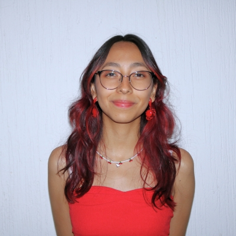

</td>
</tr>
</table>

---

<table>
<tr>
<td width="65%" valign="top">

## **Jesús Morales**

**Mechanical & CAD Designer · Software Developer**

**Age:** 19

I am an **Information Technology Engineering student** and served as the Mechanical & CAD Designer and Software Developer for our robot.

This project marked my first time fully designing an **entire mechanical system from scratch in CAD**—a challenge that required balancing spatial constraints, weight distribution, and structural integrity.

My passion for technology started at a young age, but growing up in my hometown, hands-on STEM opportunities were limited. Moving to Mexico gave me the chance to explore robotics throughout my school years, shaping my path into engineering.

WRO has been an incredible opportunity to **push my technical limits**, and I hope to inspire others to pursue STEM regardless of their background.

</td>

<td width="35%" align="center" valign="middle">

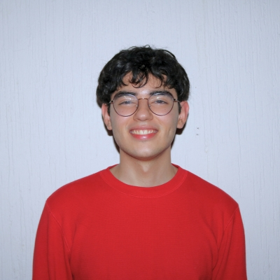

</td>
</tr>
</table>

---

<table>
<tr>
<td width="65%" valign="top">

## **Kevin Rucoba**

**Coach**

**Age:** 21

I am a **Software Development Engineering student** and have supported and advised the team throughout all areas of the project.

From helping with **technical challenges and brainstorming ideas** to guiding decisions and overcoming unexpected problems, I've always been there to provide a different perspective when needed.

My goal is to **support their ideas, share my experience, and help them turn their ideas into reality** while encouraging them to learn, experiment, and grow as a team.

I also helped the team stay focused on our goals, encouraged us to keep improving after setbacks, and shared the experience needed to approach challenges with **confidence, creativity, and perseverance**.

</td>

<td width="35%" align="center" valign="middle">

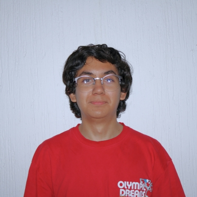

</td>
</tr>
</table>

---


## 2. Challenge Overview

## 3. Our Robot

## 4. Hardware

### 4.1. Mobility Management

### 4.2. Power and Sense Management

## 5. Software

### 5.1. Computer Vision

#### HSV calibration

##### Overview

Reliable color detection is essential for autonomous navigation. Different lighting conditions can significantly alter the appearance of objects on the field, making fixed color values unsuitable.

To solve this problem, a calibration tool was developed to adjust and store HSV ranges for each element of the competition.

The tool allows users to tune the HSV thresholds in real time and immediately visualize the resulting mask.

---

##### Calibration Interface

The interface includes:

- HSV sliders.
- Real-time camera preview.
- Binary mask visualization.
- Configuration saving.

Each color can be adjusted independently.

---

##### Calibration Workflow

```text
┌──────────────────────────┐
│       Camera Frame       │
└────────────┬─────────────┘
             │
             ▼
┌──────────────────────────┐
│      HSV Conversion      │
└────────────┬─────────────┘
             │
             ▼
┌──────────────────────────┐
│  Threshold Adjustment    │
└────────────┬─────────────┘
             │
             ▼
┌──────────────────────────┐
│      Mask Preview        │
└────────────┬─────────────┘
             │
             ▼
┌──────────────────────────┐
│    Save Configuration    │
└──────────────────────────┘
```

---

##### HSV Color Space

The calibration system converts each frame from BGR to HSV:

```python
hsv = cv2.cvtColor(frame, cv2.COLOR_BGR2HSV)
```

HSV was selected because it separates color information from illumination, allowing the system to adapt more easily to different environments.

---

##### Mask Generation

The binary mask is generated using:

```python
mask = cv2.inRange(
    hsv,
    np.array(low),
    np.array(high)
)
```

Pixels inside the selected range are preserved, while all other pixels are discarded.

---

##### Configuration Storage

The calibrated HSV ranges are stored in:

```text
config/
└── saved_ranges.py
```

These values are later loaded by the vision pipeline and used during obstacle detection and navigation.

##### Detection Examples

###### Red Signs

| Threshold Adjustment | Saving Configuration | Generated Mask |
| :---: | :---: | :---: |
|  |  |  |

---

###### Green Signs

| Threshold Adjustment | Saving Configuration | Generated Mask |
| :---: | :---: | :---: |
|  |  |  |

---

###### Blue Lines

| Threshold Adjustment | Saving Configuration | Generated Mask |
| :---: | :---: | :---: |
|  |  |  |

---

###### Orange Lines

| Threshold Adjustment | Saving Configuration | Generated Mask |
| :---: | :---: | :---: |
|  |  |  |

---

###### Parking Walls

| Threshold Adjustment | Saving Configuration | Generated Mask |
| :---: | :---: | :---: |
|  |  |  |

---

###### White Space

| Threshold Adjustment | Saving Configuration | Generated Mask |
| :---: | :---: | :---: |
|  |  |  |

#### Element detection

##### Overview

The computer vision system processes the images captured by the camera and detects the different elements present on the competition field.

The HSV ranges used by the detection algorithms are generated using the calibration tool described in [`calibration`](#hsv-calibration).

The system currently detects:

- Red signs.
- Green signs.
- Blue lines.
- Orange lines.
- Pink parking walls.
- Track space.

---

##### Vision Pipeline

```text
┌──────────────────────────┐
│       Camera Frame       │
└────────────┬─────────────┘
             │
             ▼
┌──────────────────────────┐
│      HSV Conversion      │
└────────────┬─────────────┘
             │
             ▼
┌──────────────────────────┐
│      Color Filtering     │
└────────────┬─────────────┘
             │
             ▼
┌──────────────────────────┐
│ Morphological Operations │
└────────────┬─────────────┘
             │
             ▼
┌──────────────────────────┐
│    Contour Detection     │
└────────────┬─────────────┘
             │
             ▼
┌──────────────────────────┐
│ Bounding Box Generation  │
└────────────┬─────────────┘
             │
             ▼
┌──────────────────────────┐
│     Target Selection     │
└──────────────────────────┘
```

---

##### Detection

The `process_elements()` method performs the detection process for signs and lines.

For each frame:

1. The image is converted to HSV.
2. A binary mask is generated.
3. Morphological operations remove noise.
4. Contours are extracted.
5. Small contours are discarded.
6. A target element is selected.

Each detected element stores:

- Color.
- Binary mask.
- Contour.
- Area.
- Bounding rectangle.

---

##### Sign Detection

Red and green signs are processed using:

```python
VisionUtils.select_target_pillar()
```

The selected target is determined according to:

1. Contour area.
2. Vertical position.

When both signs have similar areas, the sign located lower in the image is considered closer to the robot.

---

##### Line Detection

Blue and orange lines are processed using:

```python
VisionUtils.select_target_line()
```

Unlike signs, line detection prioritizes the vertical position because perspective distortion affects their apparent size.

If both lines are located at similar heights, contour area is used as a secondary criterion.

---

##### Track Detection

Track detection uses a different pipeline.

Before processing, red and green objects are replaced to avoid interference:

```python
image = VisionUtils.replace_color(
    frame,
    saved_ranges.color_ranges,
    ["Red", "Green"]
)
```

The image then follows the following steps:

```text
┌──────────────────────────┐
│          Resize          │
└────────────┬─────────────┘
             │
             ▼
┌──────────────────────────┐
│   Grayscale conversion   │
└────────────┬─────────────┘
             │
             ▼ 
┌──────────────────────────┐
│    Bilateral filtering   │
└────────────┬─────────────┘
             │
             ▼    
┌──────────────────────────┐
│       Thresholding       │
└────────────┬─────────────┘
             │
             ▼       
┌──────────────────────────┐
│  Morphological closing   │
└────────────┬─────────────┘
             │
             ▼    
┌──────────────────────────┐
│     Largest countour     |
|        extraction        │
└──────────────────────────┘
```

The largest valid contour is preserved and used as the track representation.

---

##### Software Structure

```text
ImageManager
    │
    ├── process_walls()
    ├── process_elements()
    ├── show_results()
    ├── run_test()
    └── run_test_from_image()

VisionUtils
    │
    ├── detect_element()
    ├── select_target_pillar()
    ├── select_target_line()
    ├── draw_element()
    ├── keep_largest_white()
    └── replace_color()
```

### 5.2. Vehicle Control

#### Obstacle challenge logic
#### Lap counting
#### Parking procedure

## 6. DIY Game Field

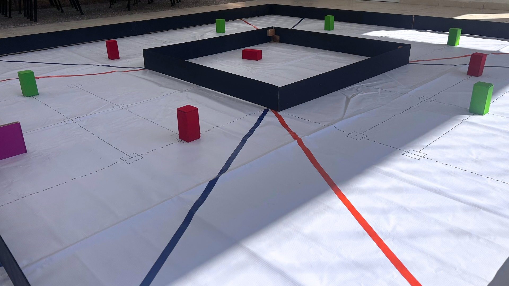

To test our autonomous vehicle under conditions closer to the actual competition, we decided to build our own full-scale game field. Having a field available for regular testing allowed us to work on autonomous navigation, computer vision, obstacle detection, and parking. Our goal was to build a field that followed the main WRO specifications while keeping it affordable, reusable, and easy to modify between tests.

---

### Materials and Budget

The total estimated cost was approximately **$50.84 USD**.

| Material | Qty | Cost (USD) | Store / Reference Link |
| :--- | :--- | :--- | :--- |
| **White Tarpaulin** (3x3m min) | 1 | $17.58 | [MercadoLibre](https://www.mercadolibre.com.mx/pared-de-3-lados-9m-para-carpa-toldo-3x3-impermeable-uv-blanco/p/MLM51398001) |
| **3mm MDF Panel** (1.22 x 2.44m) | 1 | $9.73 | [Home Depot](https://www.homedepot.com.mx/p/arauco-panel-de-mdf-3-mm-122-x-244-m-arauco-trupan-286133) |
| **Matte Black Paint for Wood** (1L) | 1 | $6.19 | Local Hardware Store |
| **Panduit ST17 Orange Tape** | 1 | $3.83 | [MercadoLibre](https://www.mercadolibre.com.mx/cinta-aislante-panduit-naranja-st17-075-66or-pvc-2012m-x-19mm/p/MLM47125027) |
| **TUK Vinyl Blue Tape** | 1 | $1.30 | [Home Depot](https://www.homedepot.com.mx/p/tuk-cinta-aislante-electrica-de-vinilo-19-mm-x-18-m-az-345325-121543) |
| **Acrylic Paint** (Magenta, Red, Green)| 3 | $6.90 | Office Depot |
| **Grey Sharpie Marker** | 1 | $1.89 | Office Depot |
| **Paint Roller & 1" Foam Brush** | 2 | $3.42 | Local Hardware Store / Home Depot |

> **Budget Tip:** We got our tarpaulin for free from a local print shop that was discarding it, so it's worth asking around before buying new.
---

### Step-by-Step Construction Guide

Each part of the field was designed to be inexpensive, easy to assemble, and reusable for future testing.

#### 1. Base Mat

The official field has an inner playing area of **3000 × 3000 mm**. We used a white tarpaulin as the base surface because it was inexpensive, easy to handle, and easy to store after testing.

---

#### 2. Exterior and Interior Walls

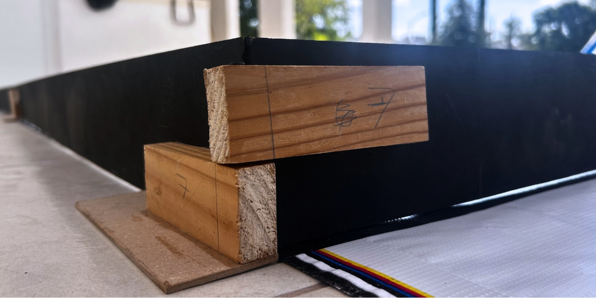

> **Material:** 3 mm MDF  
> **Height:** 100 mm  
> **Color:** Matte black

**Exterior Walls**

Since the MDF sheet is 2440 mm long and the required wall length is 3000 mm, each exterior wall was divided into two **1500 mm sections**.

The sections were connected using custom wooden puzzle joints glued to the back of the panels. The same method was used to secure the 90-degree corners.

*This allowed us to achieve the required wall length without needing a larger MDF sheet.*

**Interior Walls**

The interior walls were built as modular segments so they could be rearranged for different configurations. All interior-facing walls were painted matte black.

Because the MDF is 3 mm thick, the short segments were reduced by **2 × 3 mm** to account for the thickness of the perpendicular walls:

| Segment | Quantity | Length |
|---|---:|---:|
| Long | 2 | 1000 mm |
| Long | 2 | 1400 mm |
| Long | 2 | 1800 mm |
| Short | 2 | 994 mm |
| Short | 2 | 1394 mm |
| Short | 2 | 1794 mm |

---

#### 3. Traffic Signs & Parking Delimiters

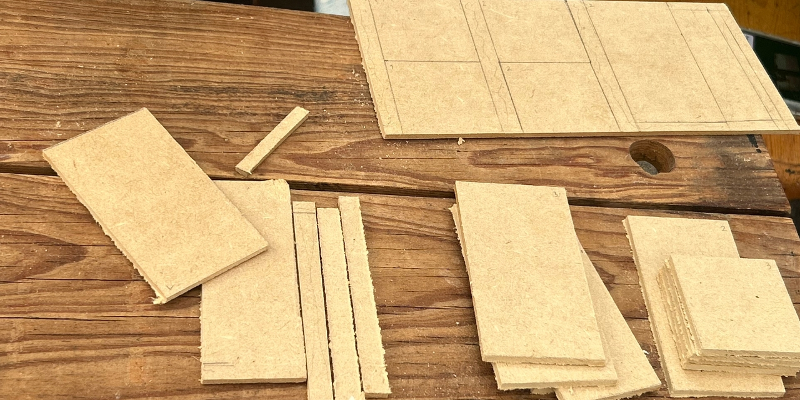

We used leftover 3 mm MDF from the wall construction to build both the traffic signs and parking delimiters as hollow structures. This reduced material usage while keeping the required external dimensions.

**Traffic Signs**

**50 × 50 × 100 mm** · **3 mm MDF** · **Red / Green**

**Cut list per sign:**
- 4 × 100 × 50 mm rectangles
- 2 × 50 × 50 mm caps

**Parking Delimiters**

**200 × 20 × 100 mm** · **3 mm MDF** · **Magenta**

**Cut list per delimiter:**
- 2 × 200 × 100 mm rectangles
- 2 × 20 × 100 mm rectangles
- 2 × 200 × 20 mm caps

> **Important:** When calculating the pieces for the hollow structures, account for the 3 mm MDF thickness to keep the final dimensions correct.

---

#### 4. Lines and Markings

The field requires **20 mm orange and blue lines**, along with thinner grey markings for the starting areas.

We initially tried painting the colored lines directly onto the tarpaulin, but the paint bled through the fabric. We switched to electrical tape instead:

- **Orange:** Panduit ST17
- **Blue:** TUK Vinyl Tape
- **Width:** close to the required 20 mm

The tape provided cleaner and more consistent lines, which was particularly important for our computer vision system.

The smaller markings and starting zones were measured and drawn manually using a ruler and grey Sharpie.

> **Design choice:** Electrical tape gave us cleaner edges and more consistent line widths than paint, making the field markings easier for our computer vision system to detect.

---

### Construction Process Gallery

|  | 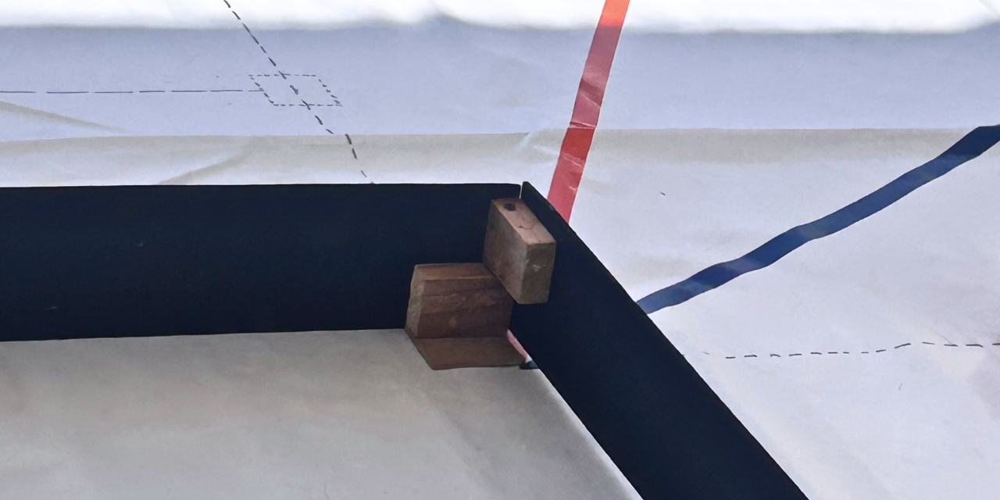 |
| :---: | :---: |
| **1.** Cutting MDF strips and assembling the exterior wall joints. | **2.** Preparing the modular interior wall segments. |
| 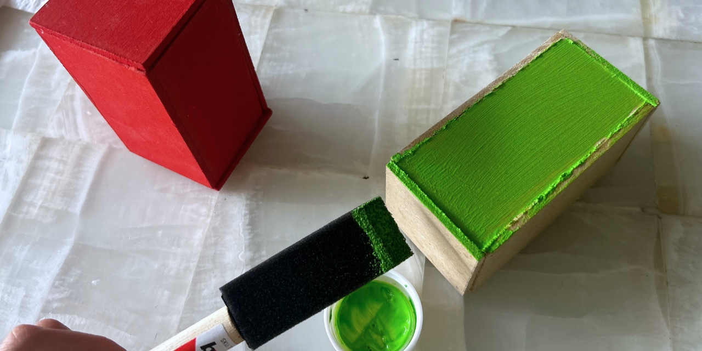 | 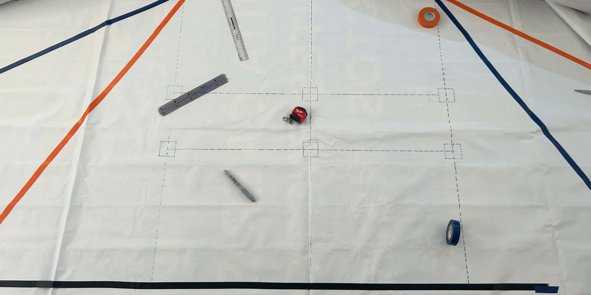 |
| **3.** Building and painting the traffic signs and parking delimiters. | **4.** Measuring and applying the field lines and markings. |

The finished field became part of our regular testing setup, giving us a consistent environment to test changes to the robot and compare their results.

## 7. License
